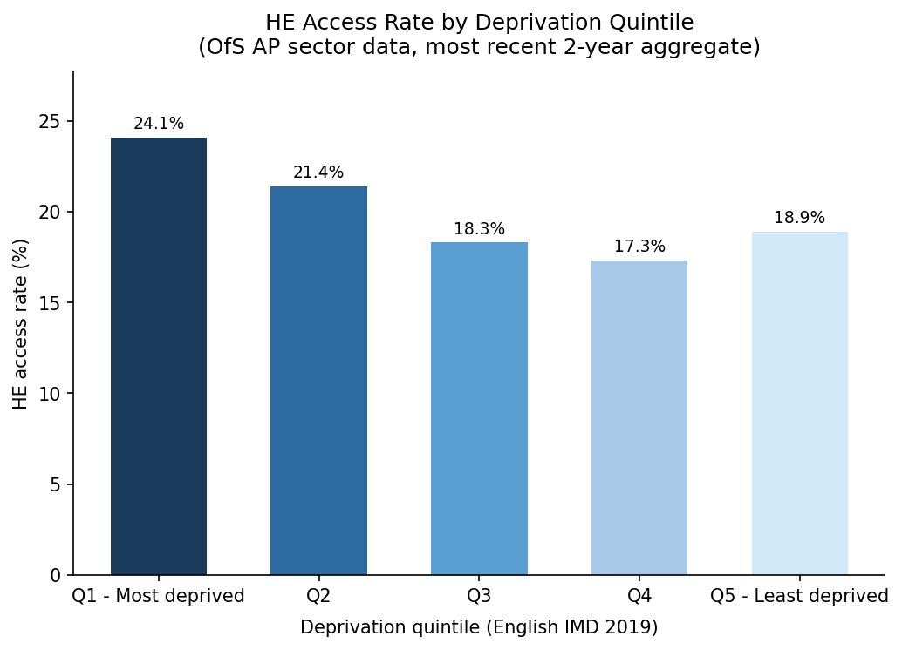
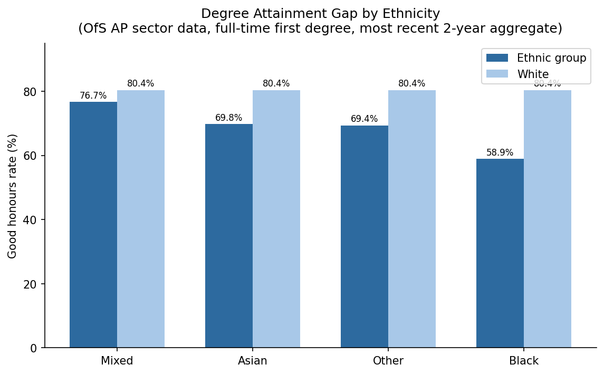
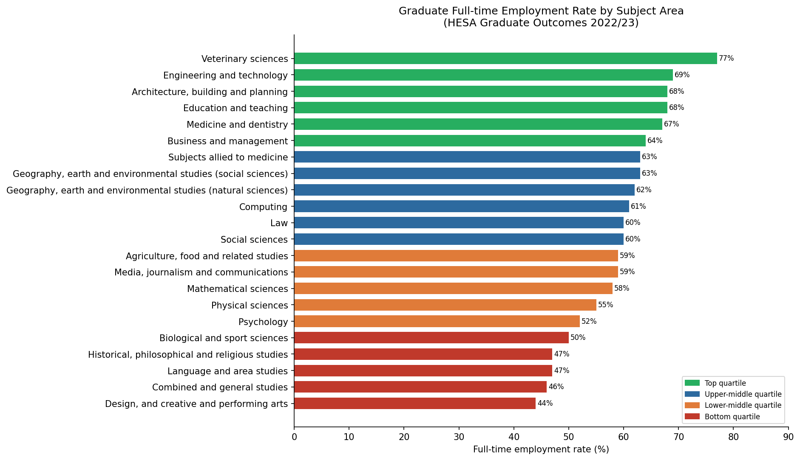
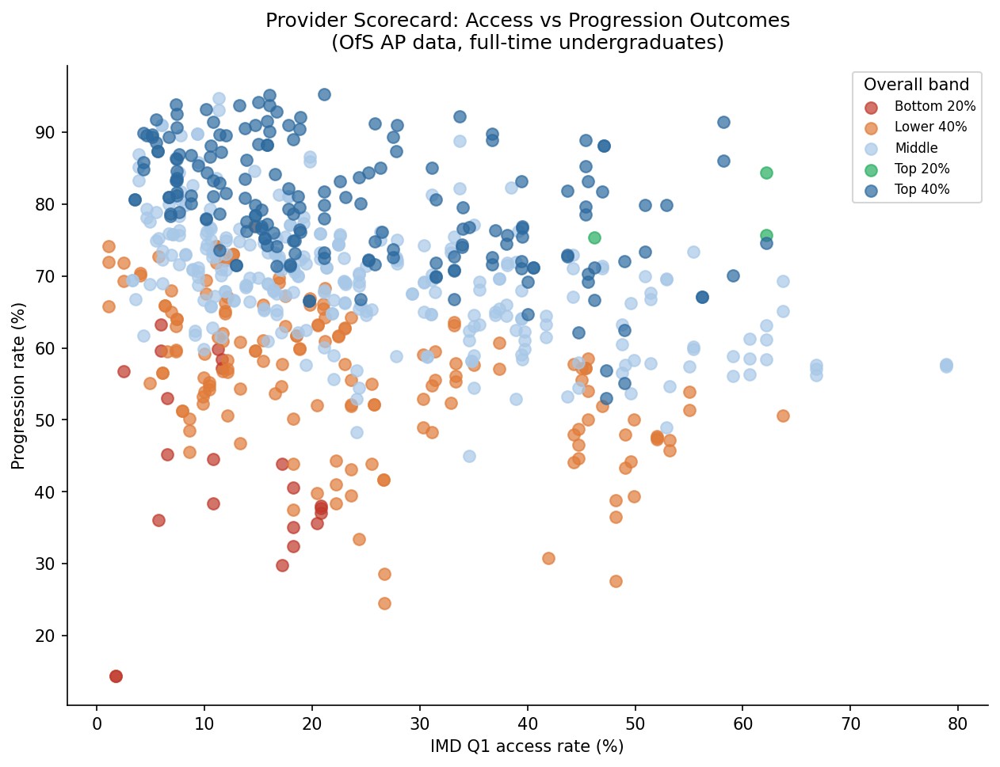

# UK Higher Education Outcomes Analysis

I analysed student access, attainment, and graduate outcomes across the English higher education sector, using open government data from OfS, HESA, and DfE.

## Data Sources

| Source | Dataset | Coverage |
|--------|---------|----------|
| [Office for Students (OfS)](https://www.officeforstudents.org.uk/data-and-analysis/access-and-participation-data/) | Access and Participation (AP) data | Provider and sector-level lifecycle metrics: Access, Continuation, Completion, Attainment, Progression |
| [HESA](https://www.hesa.ac.uk/data-and-analysis) | Graduate Outcomes SB272 (2022/23); Student Statistics SB269 | Graduate destinations 15 months post-graduation; subject enrolments |
| [DfE](https://explore-education-statistics.service.gov.uk/) | Widening Participation in HE statistics | School-to-HE progression rates by FSM status, ethnicity, SEN, school type |

## Key Findings

**Deprivation and access**
- I found that students from IMD Q1 (which is the most deprived areas) have a 24.1% HE access rate, compared to 18.9% for Q5. The relationship is non-linear, so Q5 access is lower than Q1, likely because of London's concentration of deprived yet high-participation communities.
- The FSM gap (non-FSM 49.8% vs FSM 29.0%) represents a 20.8 percentage point gap that has been widening since 2021. Which might continue to widen.
- Also, Chinese students have the highest HE progression rate at 84.0%, White Traveller of Irish Heritage the lowest at 11.5%.

**Degree attainment**
- The Black attainment gap is 21.5 percentage points: 58.9% good honours for Black students vs 80.4% for White students.
- Disabled students (77.3%) marginally outperform non-disabled (75.7%) at sector level.
- Among disability types, mental health students achieve the highest good honours rate (78.6%).

**Graduate outcomes**
- Veterinary sciences has the highest full-time employment rate 15 months after graduation (77%); Design and Creative Arts the lowest (44%).
- Medicine and dentistry graduates rank 5th for FT employment (67%) despite strong career reputation, partly because many enter postgraduate study immediately.
- The Black-White employment gap is smaller than the attainment gap, which suggests that employability factors partly compensate.

**Provider comparison**
- 651 providers analysed across access, attainment, and progression. Provider scorecard ranks institutions across all three dimensions simultaneously.

## Tools Used

SQL Server, Python (pandas, matplotlib, seaborn, openpyxl), Excel, Power BI

## Screenshots

### Access Rate by IMD Quintile

### Attainment Gap by Ethnicity

### Graduate Employment by Subject

### Provider Scorecard: Access vs Progression

